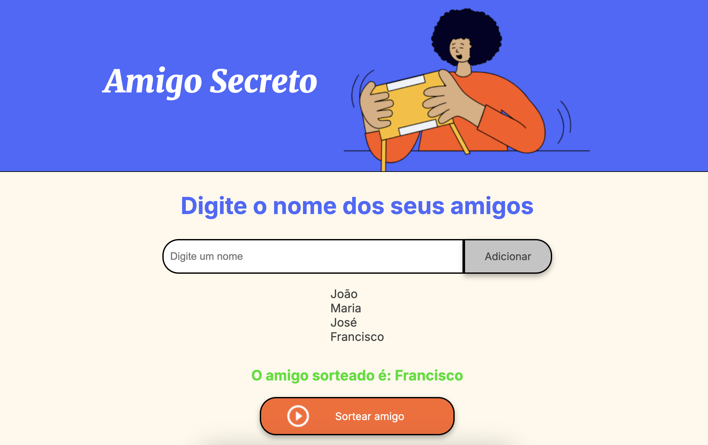

# amigo-secreto 📝

Este projeto foi desenvolvido como parte do Challenge promovido pela Oracle ONE e Alura LATAM. A ideia do desafio era criar uma aplicação simples, mas eficiente, para organizar sorteios de Amigo Secreto de maneira divertida e prática.

## Funcionalidades
- 📝 **Adicionar amigos**: Insira os nomes de seus amigos na lista de forma fácil e rápida.
- 🔍 **Visualização da lista**: Todos os nomes inseridos são mostrados logo abaixo, para você acompanhar o que foi adicionado.
- 🎲 **Sorteio automático**: Ao clicar em "Sortear amigo", o sorteio é realizado de forma aleatória, trazendo um amigo secreto para você.
- 🥳 **Exibição do resultado**: O nome do sorteado é mostrado diretamente na tela, com destaque para o vencedor!

## Como Usar
1. **Adicione amigos**: Preencha o campo de texto com o nome de um amigo e clique em "Adicionar".
2. **Veja a lista**: A lista com todos os amigos adicionados será exibida automaticamente.
3. **Faça o sorteio**: Clique em "Sortear amigo" para realizar o sorteio e ver quem será o amigo

